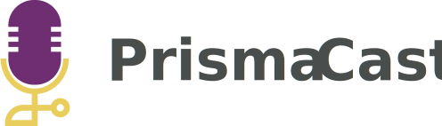

  

<!-- <h1 align="center">
  
</h1> -->

## 💻 Projeto - prisma.cast

Você pode acessar o projeto clicando neste link [Acessar Projeto](prisma-cast.vercel.app)

O prisma.cast é um app de Podcasts que pode ser utilizado em qualquer cenário, em que seja necessário ter um app próprio para distribuir ao seu público os seus Podcasts.
Este é um projeto desenvolvido como parte da evolução de uma semana de estudos com a **[Rocketseat](https://www.rocketseat.com.br)**.

## 🧪 Tecnologias

Esse projeto foi desenvolvido com as seguintes tecnologias:

- [React](https://reactjs.org)
- [NextJS](https://nextjs.org)
- [ELECTRON](https://www.electronjs.org)
- [TypeScript](https://www.typescriptlang.org/)

## 📚 Bibliotecas

Para auxiliar no desenvolvimento do projeto, utilizei as seguinte bibliotecas:

- [SWR](https://swr.vercel.app)
- [Framer](https://www.framer.com/docs/)
- [json-server](https://github.com/typicode/json-server)
- [ReactToastify](https://fkhadra.github.io/react-toastify/introduction)
- [StyledComponents](https://styled-components.com)

---

Layout desenvolvido por [Tiago Luchtenberg](https://www.instagram.com/tiagoluchtenberg/) by Rocketseat ♥
